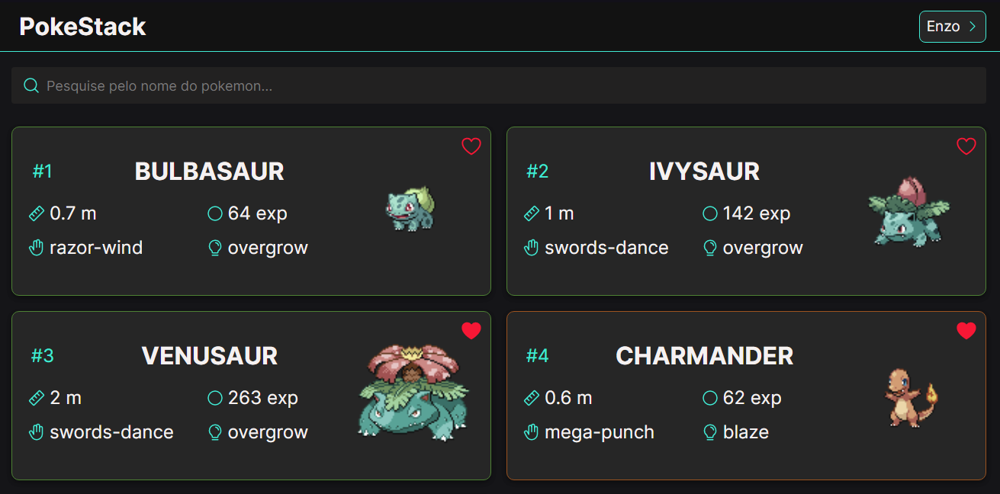

<h1 align="center">
  <a href="https://poke-stack.vercel.app">PokeStack</a>
</h1>

<h4 align="center"><a href="https://poke-stack.vercel.app">Clique para visitar o projeto</a></h4>

## 📚 Introdução 

Esse é um site que estou fazendo para treinar o uso do next e aprender mais sobre autenticação de usuário e requisições no next.

## 💼 Tecnologias utilizadas

Para o desenvolvimento deste site estou utilizando as seguintes tecnologias:

- HTML;
- CSS;
- JavaScript;
- React;
- Styled components;
- Framer motion.

---

<h2>👻 Autor</h2>

<table>
  <tr>
    <td align="center">
      <a href="https://github.com/EnzoSylvestrin">
         
        
          <b>Enzo Sylvestrin</b>
        
      </a>
    </td>
  </tr>
</table>

